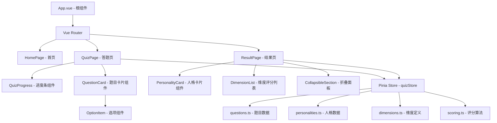

## 产品概述

"滑雪佬 MBTI" 是一个趣味性人格测试单页应用，用户通过回答 25 道与滑雪场景相关的选择题，系统根据答案在多个维度上评分，最终将用户归类为 16 种滑雪佬人格之一，并展示详细的维度评分和人格解读。

## 核心功能

### 首页

- 展示"滑雪佬 MBTI"大标题和趣味 slogan
- "开始测试"按钮进入答题页

### 答题页

- 顶部绿色进度条 + 已答题数/总题数（X/25）
- 25 道题目以卡片形式逐一展示，每题 3 个选项（A/B/C），单选
- 每张题目卡片左上角显示"第 X 题"绿色标签，右上角显示"维度已隐藏"
- 题目为第二人称滑雪场景式提问，语言口语化、幽默有趣
- 必须答完全部 25 题才能提交
- 底部双按钮：返回首页 + 提交并查看结果

### 结果页

- 顶部双栏卡片：左栏显示人格类型代号和个性短语（绿色背景），右栏显示人格中文名称、匹配度、系统备注
- 人格解读：一段幽默犀利的长文描述该人格特征
- 十维度评分列表：每个维度显示名称、等级（H/M/L）、分数、个性化解读
- 友情提示（免责声明）
- 作者的话（可折叠展开）
- 底部：重新测试 + 回到首页

### 维度体系（5 大维度 x 2 子维度 = 10 个子维度）

- T 技术取向：T1 技术追求度、T2 风格偏好
- E 装备态度：E1 装备投入度、E2 研究深度
- S 社交属性：S1 雪场社交、S2 分享欲
- A 冒险精神：A1 风险偏好、A2 探索欲
- V 氛围感：V1 滑雪动机、V2 仪式感

### 16 种滑雪佬人格

SEND（送命家）、CARV（刻弧怪）、PARK（公园崽）、POWD（追粉人）、GEAR（装备帝）、FILM（出片侠）、CHILL（咸鱼王）、GRIND（卷王）、SOCIAL（雪场交际花）、WOLF（独狼）、SAFE（安全员）、NOMAD（追雪游牧人）、NOOB（永远的初学者）、COACH（野生教练）、FLEX（氛围组）、YOLO（一季退坑人）

### 数据持久化

- 答案存储到 localStorage，key 为 `ski-mbti-answers`，每次选择/修改答案时实时写入
- 页面加载时（Pinia Store 初始化）从 localStorage 恢复已有答案，用户刷新或下次访问不丢失进度
- 结果页和首页提供"重新测试"按钮，点击后清空 localStorage 中的答案数据并重置 Store 状态，跳转到答题页重新开始

### 响应式设计

- 移动端优先，兼顾 PC 端展示
- 整体绿白配色方案，与参考站风格一致

## 技术栈

- **前端框架**：Vue 3（Composition API + `<script setup>`）
- **构建工具**：Vite 6
- **开发语言**：TypeScript
- **样式方案**：原生 CSS / CSS Variables（不引入额外 CSS 框架，参考站也是简约绿白风格，手写 CSS 更贴合需求且轻量）
- **路由**：Vue Router 4（Hash 模式，首页/答题/结果三个路由）
- **状态管理**：Pinia（存储答题状态和计算结果）

## 实现方案

### 整体策略

采用 SPA 单页应用架构，Vue Router 管理三个页面视图（首页、答题页、结果页），Pinia Store 集中管理答题状态与评分逻辑。题目数据、人格数据、评分规则全部以 TypeScript 常量数据文件存储，无需后端。

### 核心评分算法

- 每道题 3 个选项，每个选项对应 1-3 个维度的加分（正分或零分）
- 10 个子维度各有独立分值池（0-10 分区间），每题贡献 1-2 分
- 答题完成后，根据 10 个子维度的归一化得分，通过加权匹配算法计算与 16 种人格的匹配度
- 每种人格预设一个"理想维度模板"（10 维向量），采用余弦相似度或加权欧氏距离找到最匹配的人格
- 匹配度以百分比展示

### 关键技术决策

1. **数据驱动设计**：题目、选项、维度权重、人格模板全部抽离为独立数据文件（`questions.ts`、`personalities.ts`、`dimensions.ts`），便于后续调整题目或增减人格类型
2. **无后端架构**：所有逻辑在客户端完成，零运维成本，加载即可用
3. **进度条实时反馈**：通过 computed 属性实时计算已答题数，驱动进度条宽度
4. **强制完成校验**：提交按钮 disabled 状态绑定到"是否全部答完"的 computed
5. **localStorage 持久化**：Pinia Store 中 answers 数组每次变化时同步写入 localStorage（`ski-mbti-answers`），初始化时从 localStorage 恢复。"重新测试"按钮调用 store.reset() 方法，清空 localStorage 并重置状态

### 性能考量

- 25 题一次性渲染在 DOM 中（非分页），与参考站一致的全量展示 + 滚动交互
- 题目数据为静态常量，打包时 tree-shaking 自动优化
- CSS 过渡动画仅用于选项选中、进度条等轻量交互，不影响性能

## 实现注意事项

- 移动端优先的响应式布局，使用 CSS `max-width` + `margin: auto` 居中容器，媒体查询适配桌面端
- 选项点击区域需要足够大（整行可点击），移动端触控友好
- 进度条使用 CSS `transition` 实现平滑动画
- 结果页维度评分等级映射规则：0-3 分为 L（低），4-6 分为 M（中），7-10 分为 H（高）
- 折叠面板使用 `v-show` + CSS `max-height` 过渡实现

## 系统架构



## 目录结构

```
skibti/
├── index.html                    # [NEW] Vite 入口 HTML，挂载 #app
├── package.json                  # [NEW] 项目依赖配置（vue, vue-router, pinia, typescript, vite）
├── vite.config.ts                # [NEW] Vite 配置，含 vue 插件和路径别名
├── tsconfig.json                 # [NEW] TypeScript 配置
├── tsconfig.app.json             # [NEW] 应用 TS 配置
├── tsconfig.node.json            # [NEW] Node 环境 TS 配置
├── env.d.ts                      # [NEW] Vite 环境类型声明
├── public/
│   └── favicon.ico               # [NEW] 网站图标（雪花或滑雪主题）
├── src/
│   ├── main.ts                   # [NEW] 应用入口，创建 Vue app、注册 Router 和 Pinia
│   ├── App.vue                   # [NEW] 根组件，包含 RouterView
│   ├── router/
│   │   └── index.ts              # [NEW] Vue Router 配置，定义首页/答题/结果三条路由
│   ├── stores/
│   │   └── quiz.ts               # [NEW] Pinia Store，管理答题状态（用户选择的答案数组、当前进度）、提供计算维度得分和匹配人格的 getters/actions、localStorage 持久化（实时写入/初始化恢复）、reset() 清空重来
│   ├── data/
│   │   ├── questions.ts          # [NEW] 25道题目数据，每题包含题干、3个选项文本、各选项对应的维度加分规则
│   │   ├── dimensions.ts         # [NEW] 10个子维度定义（代号、名称、描述、所属大类），以及评分等级映射函数
│   │   └── personalities.ts      # [NEW] 16种人格数据，每种包含代号、名称、个性短语、系统备注、解读长文、理想维度模板向量、各维度个性化评语
│   ├── utils/
│   │   └── scoring.ts            # [NEW] 评分算法工具函数：计算维度原始分、归一化、匹配度计算（余弦相似度）、确定最终人格类型
│   ├── types/
│   │   └── index.ts              # [NEW] TypeScript 类型定义：Question、Option、Dimension、Personality、QuizState、DimensionScore 等接口
│   ├── views/
│   │   ├── HomePage.vue          # [NEW] 首页视图：大标题、slogan、开始测试按钮，居中布局，简约动画
│   │   ├── QuizPage.vue          # [NEW] 答题页视图：渲染进度条 + 25 道题目卡片列表 + 底部提交栏，管理答题交互逻辑
│   │   └── ResultPage.vue        # [NEW] 结果页视图：渲染人格卡片、解读文字、维度评分列表、友情提示、作者的话、操作按钮
│   ├── components/
│   │   ├── QuizProgress.vue      # [NEW] 进度条组件：接收 current/total props，渲染绿色进度条和计数文字
│   │   ├── QuestionCard.vue      # [NEW] 题目卡片组件：接收题目数据和当前选中值，渲染题号标签、维度隐藏标签、题干、3个选项
│   │   ├── OptionItem.vue        # [NEW] 选项组件：单个选项行，包含 radio 圆圈、选项字母、选项文字，支持选中高亮状态
│   │   ├── PersonalityCard.vue   # [NEW] 人格卡片组件：双栏布局展示人格代号、名称、匹配度、备注
│   │   ├── DimensionList.vue     # [NEW] 维度评分列表组件：遍历 10 个维度渲染分数、等级、解读
│   │   └── CollapsibleSection.vue# [NEW] 可折叠面板组件：标题 + 展开/收起按钮 + 内容区域动画
│   └── styles/
│       ├── variables.css         # [NEW] CSS 变量定义：主色调、背景色、文字色、圆角、间距等设计 token
│       ├── global.css            # [NEW] 全局样式：reset、字体、body 背景、通用布局类
│       └── transitions.css       # [NEW] 过渡动画样式：进度条平滑、选项选中、折叠展开等
```

## 关键类型定义

```typescript
// src/types/index.ts

/** 选项对维度的加分规则 */
interface DimensionWeight {
  dimensionId: string;  // 如 'T1', 'E2', 'S1'
  score: number;        // 加分值，通常 1-3
}

/** 单个选项 */
interface Option {
  label: string;        // 'A' | 'B' | 'C'
  text: string;         // 选项文字
  weights: DimensionWeight[];  // 该选项对应的维度加分
}

/** 单道题目 */
interface Question {
  id: number;
  title: string;        // 题干文字
  options: Option[];    // 3 个选项
}

/** 人格的理想维度模板 */
interface PersonalityTemplate {
  [dimensionId: string]: number;  // 如 { T1: 9, T2: 3, E1: 8, ... }
}

/** 人格类型 */
interface Personality {
  code: string;         // 如 'SEND', 'CARV'
  name: string;         // 如 '送命家', '刻弧怪'
  tagline: string;      // 个性短语
  systemNote: string;   // 系统备注
  description: string;  // 详细解读长文
  template: PersonalityTemplate;
  dimensionComments: Record<string, string>;  // 各维度个性化评语
}
```

## 设计风格

采用清新自然的绿白配色风格，与参考站 SBTI 保持高度一致的视觉语言。整体风格偏向现代极简 + 卡片式设计，营造冬日雪场的清爽干净氛围。移动端优先设计，PC 端通过 max-width 约束内容宽度（最大 720px 居中）。

## 页面设计

### 1. 首页（HomePage）

- **顶部区域**：大面积留白，页面垂直居中布局
- **标题区块**：主标题"滑雪佬 MBTI"使用大号加粗字体，下方副标题 slogan "MBTI 已经过时了，滑雪佬有自己的人格测试"，文字颜色为深墨绿色
- **装饰元素**：标题上方可放置一个简约的雪花或滑雪板 emoji/SVG 图标
- **按钮区块**：绿色圆角按钮"开始测试"，hover 时加深颜色并微微上移（translateY）产生浮起效果
- **底部信息**：浅灰小字标注"纯属娱乐，请勿当真"

### 2. 答题页（QuizPage）

- **进度条区域**：顶部固定，白色背景带底部阴影。左侧绿色进度条（圆角矩形，transition 平滑过渡），右侧显示"X / 25"计数文字
- **题目列表区域**：垂直排列 25 张题目卡片，卡片间距 16px
- **题目卡片**：白色背景、圆角 12px、浅灰边框（1px solid #e5e7eb）、轻微阴影。内部布局：
- 顶部行：左侧绿色圆角小标签"第 X 题"（背景 #4a7c59，白色文字），右侧浅绿色文字"维度已隐藏"
- 题干区：大号正文字体，深色文字
- 选项区：3 行选项，每行为独立的浅灰背景圆角卡片（hover 变为浅绿色背景），左侧 radio 圆圈 + 粗体选项字母 + 选项文字。选中状态：边框变绿、背景变为浅绿色、radio 填充绿色
- **底部操作栏**：固定在页面底部或跟随滚动。提示文字"全部答完才能提交哦"，左侧"返回首页"文字按钮，右侧"提交并查看结果"绿色实心按钮（未答完时置灰 disabled）

### 3. 结果页（ResultPage）

- **人格卡片区域**：双栏布局（移动端竖排，PC 端横排）
- 左栏：绿色渐变背景卡片，白色文字，展示"你的滑雪佬人格是："+ 人格代号（大号加粗）+ 个性短语
- 右栏：白色背景卡片，展示人格中文全名（大号标题）+ 匹配度百分比（绿色进度条形式）+ 系统备注文字
- **人格解读区域**：白色卡片，标题"这类滑雪佬的简单解读"，下方为幽默风格的长文段落
- **十维度评分区域**：标题"十维度评分"，下方为列表，每行一个维度卡片：
- 左侧：维度编号 + 维度名称（如"T1 技术追求度"）
- 右侧：等级标签（H/M/L）+ 分数
- 下方：浅灰小字的个性化评语
- 维度间用细线分隔
- **友情提示区域**：浅灰背景区块，小号文字免责声明
- **作者的话**：可折叠面板，标题旁有"展开/收起"按钮，点击展开显示内容
- **底部操作**：双按钮——"重新测试"白色描边按钮 + "回到首页"绿色实心按钮