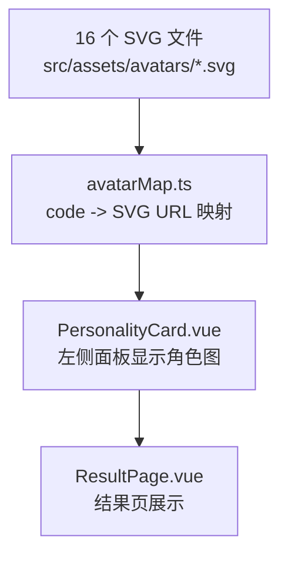

## 产品概述

为"滑雪佬 MBTI"测试结果页中的 16 种人格类型，各自生成一个低多边形（low-poly）风格的 SVG 卡通角色形象图，并嵌入到结果页的人格卡片中展示。

## 核心功能

- 为 16 种人格（SEND/CARV/PARK/POWD/GEAR/FILM/CHILL/GRIND/SOCIAL/WOLF/SAFE/NOMAD/NOOB/COACH/FLEX/YOLO）分别创建风格统一的 SVG 角色图
- 每个角色需通过服装、姿态、道具、表情等元素体现该人格的核心特质（如送命家戴头盔冲刺姿态、装备帝全身顶配、咸鱼王拿热饮等）
- SVG 图片风格参考低多边形/扁平几何卡通人物，配色柔和，简洁表情
- 图片展示在结果页 PersonalityCard 组件中，位于左侧面板（人格代码下方）或独立展示区域

## 技术栈

- 现有项目：Vue 3 + TypeScript + Vite
- SVG 文件：手写内联 SVG，存放在 `src/assets/avatars/` 目录下
- 通过 Vite 的静态资源导入机制加载 SVG

## 实现方案

### 整体策略

1. 创建 16 个独立的 SVG 文件，每个文件是一个低多边形风格的滑雪人物角色
2. 创建一个 `avatarMap` 映射模块，将人格 code 映射到对应的 SVG 资源
3. 修改 `PersonalityCard.vue` 组件，在左侧面板添加角色图片展示区域

### 关键技术决策

**SVG 角色设计规范：**

- 画布尺寸统一 200x260，viewBox="0 0 200 260"
- 低多边形风格：使用 `<polygon>` 和 `<path>` 构建几何化身体、头部、四肢
- 简洁表情：圆点眼睛 + 简单线条嘴巴/眉毛
- 每个角色的差异化通过以下要素区分：
- 服装颜色和款式（雪服/休闲装/全套护具等）
- 手持道具（雪板/相机/热饮杯/手机等）
- 姿态（冲刺/放松/跳跃/拍照等）
- 头部装饰（头盔/雪镜/帽子等）
- 配色使用项目主色系的柔和变体，每个人格有专属主色调

**资源加载方式：**

- SVG 文件放在 `src/assets/avatars/` 目录下，以人格 code 小写命名（如 `send.svg`）
- 通过 Vite 的 `import` 静态导入获取 URL，在 `avatarMap.ts` 中集中管理
- PersonalityCard 通过 `` 引用，保持组件简洁

**组件布局调整：**

- PersonalityCard 左侧面板在标语下方增加角色图片展示
- 图片尺寸约 140x180px，居中显示
- 添加淡入上浮的入场动画效果

## 实现备注

### 性能考量

- SVG 文件体积控制在 3-8KB/个，16 个总计约 50-120KB，对加载无压力
- 使用 `` 标签加载而非内联 SVG，避免增大组件 DOM 复杂度
- Vite 构建时会自动处理资源哈希和缓存

### 向后兼容

- `Personality` 接口无需修改，avatar 路径通过独立的 map 模块按 code 查找，不侵入现有数据结构
- PersonalityCard 组件的整体布局保持不变，仅在左侧面板内部追加图片区域

## 架构设计



## 目录结构

```
src/
├── assets/
│   └── avatars/
│       ├── send.svg       # [NEW] 送命家 - 冲刺姿态，戴头盔雪镜，身体前倾，配色红橙
│       ├── carv.svg       # [NEW] 刻弧怪 - 刻滑姿势，身体倾斜压弯，配色深蓝
│       ├── park.svg       # [NEW] 公园崽 - 跳跃姿态，抱着单板，配色亮绿
│       ├── powd.svg       # [NEW] 追粉人 - 粉雪飞溅姿态，张开双臂，配色天蓝白
│       ├── gear.svg       # [NEW] 装备帝 - 站姿展示全身装备，手托雪板，配色金黄
│       ├── film.svg       # [NEW] 出片侠 - 拿相机/手机拍照姿态，配色粉紫
│       ├── chill.svg      # [NEW] 咸鱼王 - 靠坐姿态，手捧热饮，配色暖棕
│       ├── grind.svg      # [NEW] 卷王 - 弯腰练习姿态，认真表情，配色深绿
│       ├── social.svg     # [NEW] 雪场交际花 - 张开双臂打招呼，笑脸，配色橙黄
│       ├── wolf.svg       # [NEW] 独狼 - 单手插兜，戴耳机，冷酷，配色灰黑
│       ├── safe.svg       # [NEW] 安全员 - 全副护具，双手交叉，配色蓝白
│       ├── nomad.svg      # [NEW] 追雪游牧人 - 背包+雪板，行走姿态，配色棕绿
│       ├── noob.svg       # [NEW] 永远的初学者 - 摔倒/蹲姿，搞笑表情，配色浅蓝
│       ├── coach.svg      # [NEW] 野生教练 - 指点姿态，一手指前方，配色橄榄绿
│       ├── flex.svg       # [NEW] 氛围组 - 时尚站姿，墨镜，配色粉橘
│       └── yolo.svg       # [NEW] 一季退坑人 - 瘫坐/摊手，迷茫表情，配色灰蓝
├── data/
│   └── avatarMap.ts       # [NEW] 人格 code 到 SVG 资源 URL 的映射模块，集中 import 16 个 SVG
├── components/
│   └── PersonalityCard.vue # [MODIFY] 左侧面板增加角色图片展示区域，添加 img 标签和对应样式
└── types/
    └── index.ts            # [不修改] Personality 接口保持不变
```

## Agent Extensions

### SubAgent

- **code-explorer**
- 用途：在实现过程中如需确认其他组件的样式变量或布局细节，用于快速检索
- 预期结果：精确定位需要参考的文件和代码片段