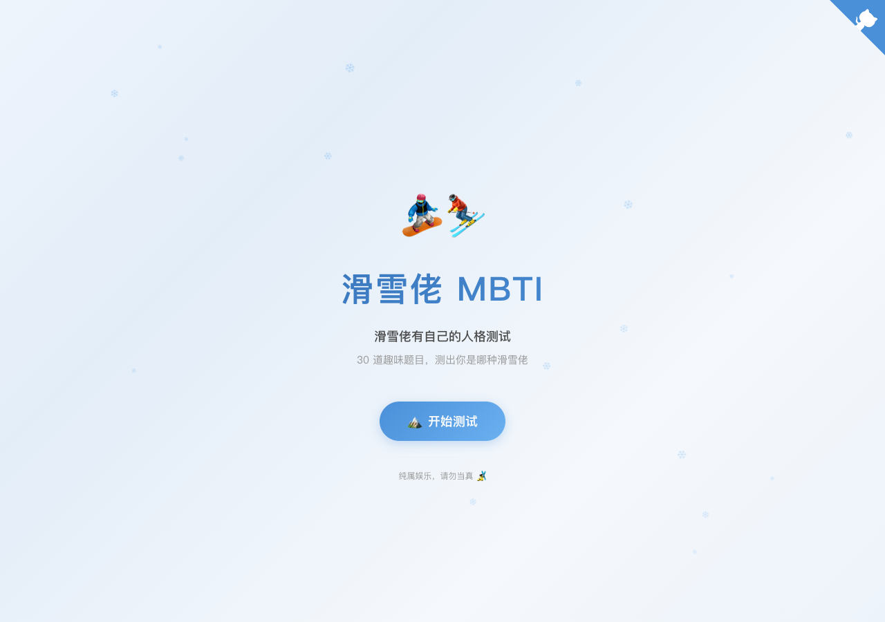
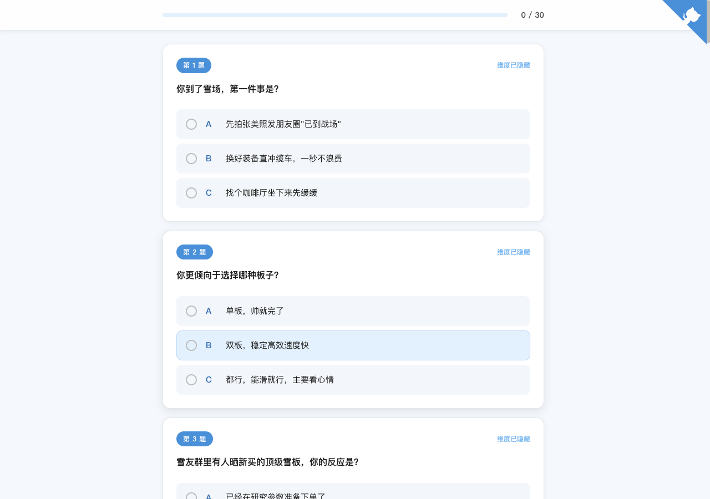
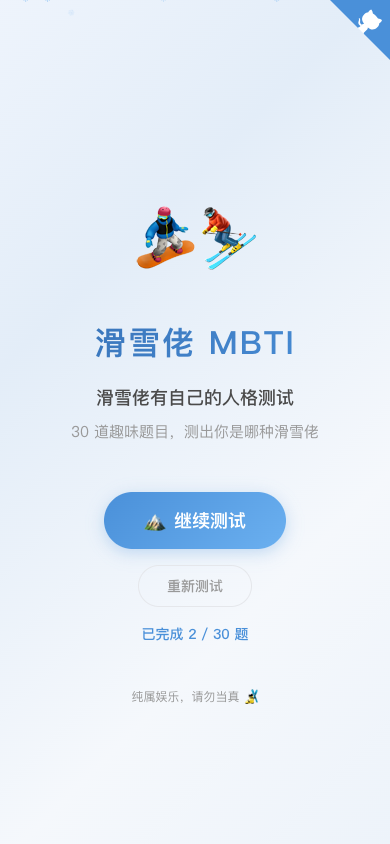

# 和 AI 一起做了一个滑雪人格测试

今天刷手机，朋友圈和微博全是"你的 SBTI 是什么"。SBTI 这个玩梗版人格测试一夜之间刷屏了，到处都有人在晒自己的结果，什么"伪人 FAKE"、"尤物 SLAY"、"愤世者 SHIT"……比正经 MBTI 接地气多了。

我是一个滑雪爱好者。看着满屏的 SBTI 截图，脑子里冒出一个想法：滑雪圈也能搞一个这样的测试吧？雪场上那些人，送命家、刻弧怪、装备帝、咸鱼王，哪个雪友没在缆车上见过？这些角色比什么 INFJ、ENTP 生动多了。

我同时也是一个干了好些年的前端开发工程师。所以这个想法从冒出来到"我应该能做出来"，中间没什么犹豫。区别在于，这次我打算全程让 AI 来写代码，我只管说需求和把关效果。

---

*部署完成的首页，飘着雪花*

---

从第一句对话到网站上线，不到一天。这篇文章主要聊的是这个过程，以及我和 AI 是怎么配合的。

## 先把想法谈清楚

打开对话框，我说了一句"帮我做一个滑雪人格测试网站"。

AI 没有直接开干，而是开始问我：分几种人格？怎么测？结果怎么展示？这些我其实都没想清楚，只有一个模糊的感觉："滑雪圈的人可以分成好几类，各有各的样子"。

就顺着这个聊。人格数量最后定了 16 种，参考了 MBTI 的规模但内容完全是自己来的：送命家（SEND）、刻弧怪（CARV）、咸鱼王（CHILL）、装备帝（GEAR）……每个名字对应的都是雪场上你真实见过的那种人。题目定了 30 道，另外加了 10 道隐藏题，选了特定选项才会出现，主要是为了有点惊喜感。结果页要有雷达图，还要有能让人觉得"这说的是我"的个性评语。

这个阶段我没怎么思考技术实现，就是在聊我想要什么效果。AI 会给一些建议，比如要不要加隐藏题机制，我来决定要还是不要。

## 说说感觉，它来写代码

需求谈完，AI 开始构建。

这些东西我自己写当然也能写，但这次的目的就是试试全程 Vibe Coding 能走多远。所以我故意只说效果不说实现："首页要飘雪花""按钮要冰蓝色调""答题页一次显示全部题目，不要一题一翻页""结果出来要有点仪式感"。AI 写好代码跑起来，我在浏览器里看效果，哪里不对说哪里。

*30 道题铺在一个长页面里，选完直接提交*

不过有些地方还是需要我自己的专业判断来兜底。比如测试结果的持久化，AI 默认是每次进结果页都重新算，刷新一下就没了。我直接让它把结果存到 localStorage 里，这样用户不小心关了页面或者过一会儿再打开，之前的结果还在，不用重新做 30 道题。这种体验层面的细节，AI 不会主动想到，得有人点一下。

说一个改动，看到结果，可能就几十秒。循环很快。但快不等于可以不过脑子，我一直在做的事是判断"这个对不对""那个好不好看"，以及在关键环节用自己的经验补位。

## 算法那块来回折腾了好几轮

做到一半我发现问题：有些人格测不出来。不管选什么组合，"咸鱼王 CHILL"和"退坑人 YOLO"几乎永远混淆；某些选项无论怎么选都没有区分力。

我把这个问题告诉 AI，它帮我做了一次系统分析，发现了几个原因：维度覆盖不均匀（有的维度在题目里出现 25 次，有的才 8 次），保守类选项缺权重，几种"佛系"人格的特征向量距离太近，几乎重叠。

然后我们重新设计了评分方案。把原来的余弦相似度换成加权欧氏距离，引入了负分机制——选择保守或低参与度的选项会在对应维度得负分，不是简单的低分；给每种人格定义了几个核心维度，这些维度的权重翻倍；把容易混淆的人格模板之间的距离手动拉开。

这块改了两三轮。我负责的是描述具体现象，比如"我测了一圈，CHILL 人格基本出不来"，AI 负责分析和修改代码。我不需要知道欧氏距离是什么，但我需要知道哪里不对。

## 细节是一点点加上去的

基本功能跑通之后，我开始往里加东西。

每种人格加一个低多边形风格的头像，AI 用 SVG 手绘了 16 个，各自配色不同。首页飘的雪花用的是 CSS 动画，20 个粒子随机分布。主题色原来是绿色，我嫌不够冰雪感，换成了冰蓝色系。测完之后要能分享出去，加了一个 Canvas 生成海报的功能，一键下载 PNG。还有一个调试用的开发者模式，在 localStorage 写一个 key 就能出现隐藏面板，可以直接跳到任意一个人格的结果页，省得每次调试都要答完 30 道题。

每加一个功能的流程都差不多：我说要什么，AI 实现，我看效果，不对再说。

*手机上的样子，毕竟大部分人是刷到链接然后手机打开*

## 部署

做差不多了，配了 GitHub Actions，每次推代码就自动构建部署到 GitHub Pages。

地址：[https://jrainlau.github.io/ski-mbti/](https://jrainlau.github.io/ski-mbti/)

*"送命家 SEND"的结果——黑道冲！树林冲！悬崖冲就完了*

*10 个维度的雷达图加每个维度的具体评语*

---

整件事回头看，我做的主要是三件事：提供关于滑雪圈的具体知识（什么样的人属于哪种人格、评语怎么写才够准）；不断试用然后指出哪里不对；以及在体验和工程细节上用自己的经验兜底（localStorage 持久化、开发者模式的设计、移动端适配的优先级判断这些）。代码是 AI 写的，但方向盘一直在我手里。正因为我自己懂前端，才知道哪些地方 AI 会漏、哪些地方该插手、哪些地方让它自由发挥就行。

如果你也滑，去测一下：[https://jrainlau.github.io/ski-mbti/](https://jrainlau.github.io/ski-mbti/)

测完截图发朋友圈。不发朋友圈等于没去滑雪。
